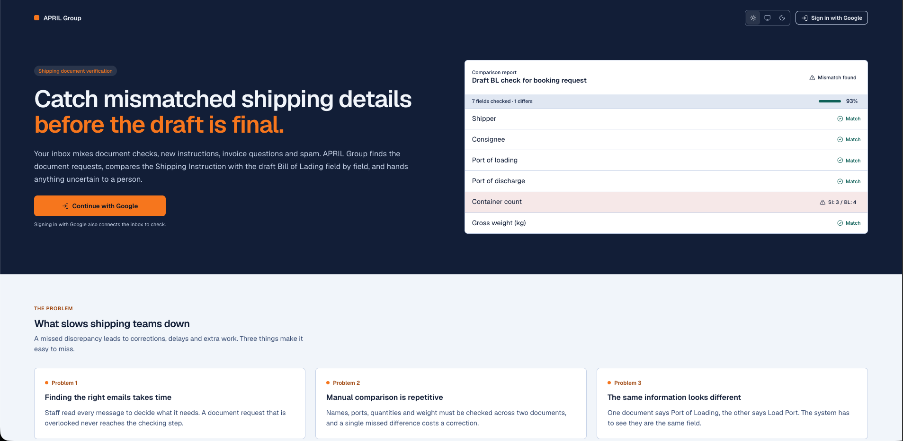
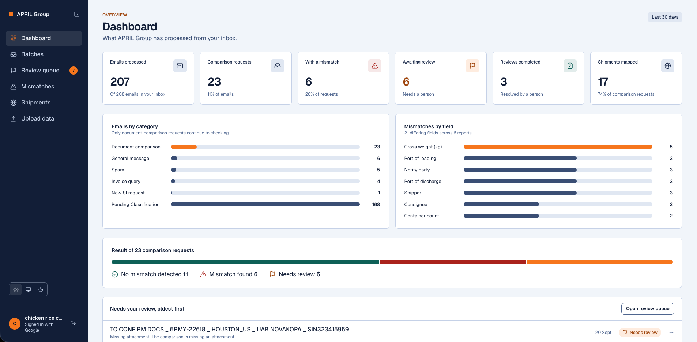
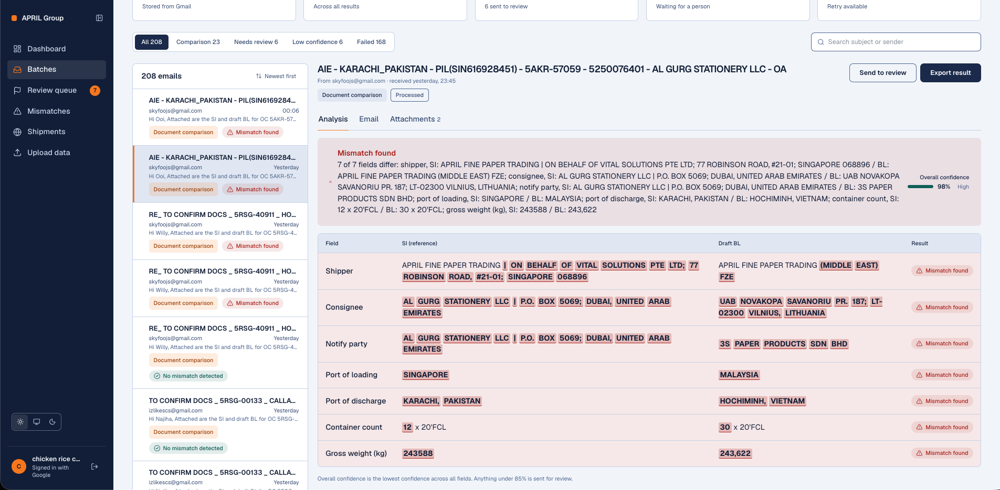
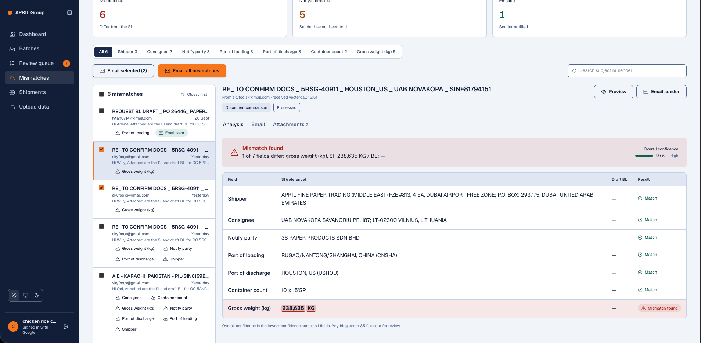
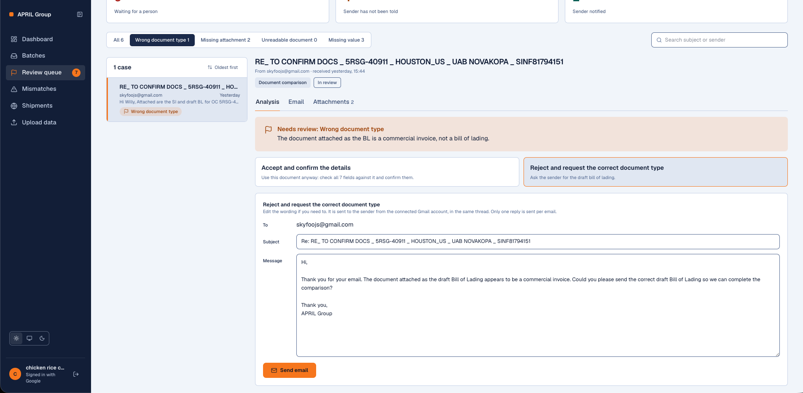
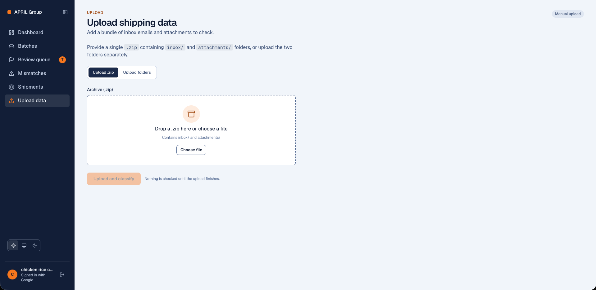
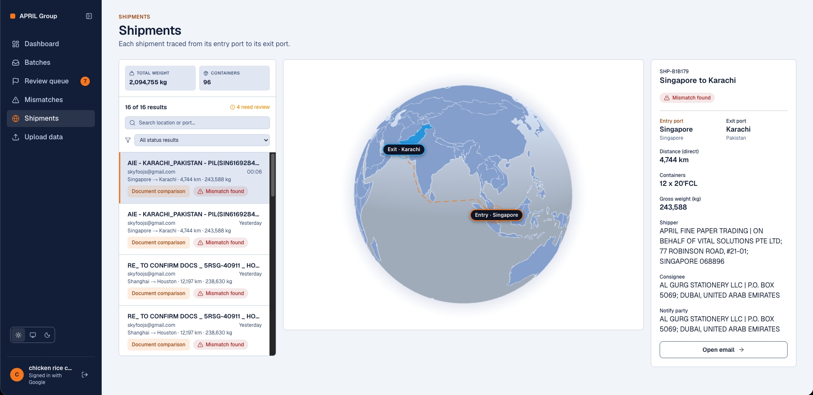

# APRIL Group — Shipping Document Verification

Catch mismatched shipping details before the draft is final. This app watches an inbox, reads the Shipping Instruction and the draft Bill of Lading attached to each document-comparison email, and tells you exactly which of the 7 key fields differ — with a human review queue for anything it can't decide on its own.

> **Hackathon:** Averis x Monash Hackathon 2026, organized by Averis, Malaysia Digital, Google Developer Group – Monash University Malaysia, and Monash University Malaysia Tech Club.
> **Team:** Lam Way Hou (lead), Isaac Yeow Ming, Foo Jia Seng, Tan Li Yang, Liew Wei Shen.
> **Live demo:** _TBD — add deployed URL and/or demo video link here._

## Table of contents

- [The problem statement](#the-problem-statement)
- [What it does](#what-it-does)
- [How it works](#how-it-works)
- [Screenshots](#screenshots)
- [Tech stack](#tech-stack)
- [Project structure](#project-structure)
- [Getting started](#getting-started)
- [Environment variables](#environment-variables)
- [Running it](#running-it)
- [Known gaps](#known-gaps)

## The problem statement

From the hackathon brief: a shipping operations team's inbox mixes document-checking requests with new SI requests, invoice questions, operational updates and spam. For a document-checking request, the team compares a Shipping Instruction (SI) — the reference — against a draft Bill of Lading (BL), across 7 fields: **shipper, consignee, notify party, port of loading, port of discharge, container count, gross weight (kg)**. Three problems make this slow and error-prone by hand:

- Finding the right emails takes time, and an overlooked request never gets checked.
- Manual comparison across two documents is repetitive and easy to get wrong.
- The same field can be worded differently between documents (e.g. "Port of Loading" vs "Load Port"), and a naive check would flag that as a false mismatch.

The brief asks for four capabilities — **classify, extract, compare, ask for help** — starting from a dataset of JSON email records with plain-text attachments, with an advanced stage covering PDF/Word attachments, scanned documents (OCR/vision), messier real-world inputs, and reliable human review. This project's "What it does" section below maps directly onto those four capabilities.

## What it does

This project automates that check end to end:

1. **Classify** every incoming email into one of 5 categories (document comparison, new SI request, invoice query, general message, spam).
2. **Extract** the 7 compared fields — shipper, consignee, notify party, port of loading, port of discharge, container count, gross weight (kg) — from both the SI and the draft BL attachments.
3. **Compare** the two sets of values and report `No mismatch detected` or `Mismatch found`, naming every differing field with both values side by side (e.g. container count, SI: 3 / BL: 4).
4. **Escalate** anything the model can't safely decide (missing attachment, wrong document type, unreadable scan, missing value) to a **Review queue**, where a person confirms the fields or rejects and asks the sender to resend — never a silent guess.

The app ships three ways to run that pipeline:

- **Phase 1 — single-email API:** `POST /api/process-email` takes one email record in the brief's JSON shape (`email_id`, `from`, `subject`, `body`, `attachments[]`) and returns the classification + comparison for it. Useful for testing one record at a time, or piping through the organizer's `loader.py`.
- **Phase 2 — batch upload:** `/upload` accepts the brief's static bundle shape — a zip, or an `inbox/` + `attachments/` folder pair — runs every email through the pipeline, and exports a `submission.json` keyed by `email_id` (category, status, review reason, defect fields), ready to check against the organizer's self-evaluation server (`docker compose up` + `POST /submit`, not included in this repo).
- **Phase 3 — live product:** sign in with Google, connect a real Gmail inbox, and get a full UI — Dashboard, Batches, Review queue, Mismatches, and a 3D globe of shipments (`/shipments`) traced from entry port to exit port. This is this team's extension beyond the brief's starting dataset — the same classify/extract/compare/review pipeline, running on live mail instead of a static JSON bundle.

## How it works

```
Gmail inbox (Phase 3) ──sync──┐
JSON bundle / zip (Phase 1–2) ┴──▶ emails + attachments (Supabase Storage)
                              │
                              ▼
                    lib/email-processing
              (extract text: PDF / DOCX / DOC / XLSX)
                              │
                              ▼
                lib/email-classification (OpenRouter LLM)
        classify → extract 7 fields from SI and BL → compare
                              │
                 ┌────────────┴────────────┐
                 ▼                         ▼
         OK / MISMATCH                NEEDS_REVIEW
      (auto-reported result)      (missing/unreadable/
                 │                  wrong doc/missing value)
                 ▼                         ▼
         Batches / Mismatches         Review queue
         (email the sender)         (confirm or reject)
```

Every result carries a confidence score (0–100). Anything scoring below the auto-accept threshold (85%) is routed to review regardless of status.

## Screenshots

| Landing | Dashboard |
| --- | --- |
|  |  |

| Batches — comparison table | Mismatches |
| --- | --- |
|  |  |

| Review queue | Upload data |
| --- | --- |
|  |  |

**Shipments globe**



## Tech stack

- **Framework:** Next.js 16 (App Router, Turbopack) + React 19 + TypeScript
- **Styling:** Tailwind CSS v4, custom design tokens (light/dark) in `app/globals.css`
- **Database & auth:** Supabase (Postgres, Row Level Security, Google OAuth)
- **LLM:** OpenRouter (classification + field extraction), via `@openrouter/sdk`
- **Email:** Gmail API (`googleapis`) — sync, push notifications (Pub/Sub webhook), send-as-reply
- **Document parsing:** `unpdf` (PDF), `mammoth` (`.docx`), `word-extractor` (`.doc`), `exceljs` (`.xlsx`)
- **Shipments globe:** `globe.gl` + `topojson-client` + `world-atlas`, distances via `searoute-js`

## Project structure

```
app/
  (app)/            Signed-in pages: dashboard, batches, review, mismatches, shipments, upload
  api/               API routes: emails sync/process, Gmail webhook, reviews, mismatches, /process-email, /upload
lib/
  email-classification/   LLM prompt, schemas, classifyEmail()
  email-processing/       Attachment text extraction, per-document SI/BL storage
  batches/                Data layer + types for the Batches/Review/Mismatches UI
  google/                 Gmail client, OAuth, send-as-reply
  supabase/               Supabase client (browser/server) + session handling
  upload/                 Zip/folder ingestion, submission.json formatting
docs/                Design handoff, requirements checklist, UI revamp notes
supabase/schema.sql  Full database schema (tables, views, RPCs)
```

## Getting started

### 1. Prerequisites

- Node.js 20+
- A [Supabase](https://supabase.com) project
- A [Google Cloud](https://console.cloud.google.com) project with the Gmail API enabled (for live Gmail sync — optional if you only want Phase 1/2)
- An [OpenRouter](https://openrouter.ai) API key

### 2. Clone and install

```bash
git clone <repo-url>
cd averisxmonash
npm install
```

### 3. Set up Supabase

1. Create a new Supabase project.
2. Run [`supabase/schema.sql`](supabase/schema.sql) against it (SQL editor, or `supabase db push` if you use the CLI) to create the tables, the `batch_emails` view, and the RPCs the app calls (`batch_email_stats`, `claim_next_email_processing_job`, `claim_email_send`, `resolve_review`, etc.).
3. In **Authentication → Providers**, enable **Google** and set the redirect URL to `<your-app-url>/auth/callback`.
4. Copy the project URL and the publishable (anon) key, plus the service role key (Settings → API) — you'll need these for the env vars below.

### 4. Set up Google OAuth + Gmail API (for live inbox sync)

1. In Google Cloud Console, create OAuth 2.0 credentials (Web application) and enable the **Gmail API**.
2. Add `<your-app-url>/auth/callback` (and `http://localhost:3000/auth/callback` for local dev) as an authorized redirect URI — this is the same OAuth client Supabase Auth uses for sign-in.
3. To let the server sync mail on its own (background sync, not just the signed-in browser session), generate a refresh token for the Gmail account you want to watch, with at least the `gmail.readonly` scope (and `gmail.send` if you want the app to reply to senders from Review/Mismatches).
4. Optional — real-time sync instead of polling: set up a Pub/Sub topic and push subscription pointing at `POST /api/gmail/webhook`, and call `POST /api/gmail/watch` once to start watching the mailbox. Skip this and just use the "Sync emails" button if you don't need push updates.

### 5. Set up OpenRouter

Create an API key at [openrouter.ai](https://openrouter.ai/keys) and pick a model that supports tool calling (the classifier requires it — see `lib/email-classification/prompt.ts`).

### 6. Configure environment variables

Copy the example file and fill it in:

```bash
cp .env.example .env
```

## Environment variables

| Variable | Required for | Notes |
| --- | --- | --- |
| `NEXT_PUBLIC_SUPABASE_URL` | Everything | Supabase project URL |
| `NEXT_PUBLIC_SUPABASE_PUBLISHABLE_KEY` | Everything | Supabase anon/publishable key |
| `SUPABASE_SERVICE_ROLE_KEY` | Server-side sync/processing | Keep secret — never expose to the client |
| `OPENROUTER_API_KEY` | Classification (Phase 1/2/3) | From openrouter.ai |
| `OPENROUTER_MODEL` | Classification | e.g. a tool-calling-capable model slug |
| `GOOGLE_CLIENT_ID` / `GOOGLE_CLIENT_SECRET` | Gmail sync, sign-in | From the Google Cloud OAuth client |
| `GOOGLE_REDIRECT_URI` | Gmail sync | e.g. `http://localhost:3000/auth/callback` |
| `GOOGLE_REFRESH_TOKEN` | Background Gmail sync | Refresh token for the watched mailbox |
| `GMAIL_SYNC_USER_ID` | Background Gmail sync | Supabase user id the synced mail is stored under |
| `GMAIL_PUBSUB_TOPIC` | Push notifications (optional) | `projects/<gcp-project>/topics/<topic>` |
| `GMAIL_PUSH_AUDIENCE` | Push notifications (optional) | `https://<your-domain>/api/gmail/webhook` |
| `GMAIL_PUSH_SERVICE_ACCOUNT` | Push notifications (optional) | `<name>@<gcp-project>.iam.gserviceaccount.com` |
| `CRON_SECRET` | Scheduled jobs (optional) | Shared secret to authorize cron-triggered routes |

## Running it

```bash
npm run dev      # start the dev server at http://localhost:3000
npm run build    # production build
npm run start    # run the production build
npm run lint     # ESLint
```

### Try Phase 1 (single email, no UI)

```bash
curl -X POST http://localhost:3000/api/process-email \
  -H "Content-Type: application/json" \
  -d '{
    "email_id": "sample-1",
    "from": "ops@example.com",
    "subject": "Draft BL for booking 12345",
    "body": "Please check the attached SI and draft BL.",
    "attachments": []
  }'
```

### Try Phase 2 (batch upload → submission.json)

Sign in, go to **Upload data**, and upload either a zip or an `inbox/` + `attachments/` folder pair (the brief's static-bundle layout). Results are shown in a table and exported as `submission.json`, keyed by `email_id` ([`lib/upload/format-results.ts`](lib/upload/format-results.ts)) — feed that into the organizer's self-evaluation server (their `docker-compose`/`loader.py`, not part of this repo) to get a scoreboard.

### Try Phase 3 (live app)

Sign in with Google on `/`, click **Sync emails** on `/batches` to pull the connected inbox, and open any "Document comparison" email to see the field-by-field report.

## Known gaps

- **Scanned documents:** an image-only PDF with no text layer is routed straight to review; there's no OCR/vision fallback yet.
- **Table-heavy layouts:** text extraction is flattened, so multi-column PDFs can scramble label/value pairs.
- Per-field confidence is no longer surfaced in the UI (only the overall email confidence), by design — see the comparison table in `/batches`.

## Team

Built for the **Averis x Monash Hackathon 2026** by:

- Lam Way Hou — Team Lead
- Isaac Yeow Ming
- Foo Jia Seng
- Tan Li Yang
- Liew Wei Shen
